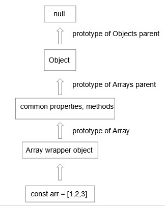
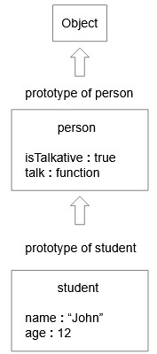

## Introduction

- JavaScript is a prototype based language it uses prototypes for property, method lookup and code reusability through inheritance.

- In this post we'll learn about prototypes, prototype chain and prototypical inheritance.

## Prototype and prototype chain

- In JavaScript there are two types of data one is primitive
  (numbers, strings, boolean) and the other is object type (arrays, object literals and functions).

- Both the primitive and the object types are wrapped by their respective objects.

- The numbers are wrapped by `Number`, strings are wrapped by `String`, booleans are wrapped by `Boolean`.

- The arrays are wrapped by `Array`, objects are wrapped by `Object`, functions are wrapped by `Function`.

- All these wrapper objects have a property called prototype.

- This prototype is an object which contains all the reusable properties, methods and it also has the prototype of its parent.

- The parent of all these wrapper objects is the global object called `Object`.

- The chain of objects linked together by the prototypes is called as the prototype chain.

- Now let us visualize the prototype chain using an example.

<p style="text-align:center"></img></p>

- Let use see how this works in code.

- To get the prototype of a variable we can use the `Object.getPrototypeOf()` method.

```javascript
const arr = [1, 2, 3];

const arrWrapperProto = Object.getPrototypeOf(arr);

console.log(arrWrapperProto); // Array

const objectProto = Object.getPrototypeOf(arrWrapperProto);

console.log(objectProto); // Object

const objectParentProto = Object.getPrototypeOf(objectProto);

console.log(objectParentProto); // null
```

## Property, method lookup

- If you are trying to access a property or method, first JavaScript looks in the current object.

- If it is not found then using the prototype chain it looks up in the parent object.

- This continues till the property or method is found or null is reached.

- This is how the lookup for property or method takes place.

## Prototypical inheritance

- The main use case of prototypes is to reuse code by inheritance.

- And the inheritance is possible because of the prototype chain.

- Let's take an example to understand.

```javascript
const person = {
  isTalkative: true,
  talk() {
    console.log("Talking...");
  },
};

const student = {
  name: "John",
  age: 12,
};

Object.setPrototypeOf(student, person);

console.log(student.name); // John

console.log(student.isTalkative); // true

student.talk(); // Talking...

console.log(Object.getPrototypeOf(student) === person); // true
```

- Here we are using the `Object.setPrototypeOf()` and setting the prototype of the student as person.

- This means that the protoype of student will be person or in other words the student prototypically inherits the properties and methods from the person.

- Due to this the student will have access to all the properties and methods in person.

- Let's visualize the prototype chain for the above example.

<p style="text-align:center"></img></p>

- Here the prototype of student is person, the prototype of person is `Object` and the prototype of `Object` is null.

- This means that the student will have access to all the properties and methods from person and `Object`.

- Similarly the person will have access to all the properties and methods from the `Object`.

## Creating objects

- Now that we have learnt about prototypes let us see how to create our own objects using prototypes.

```javascript
function Student(name, age) {
  this.name = name;
  this.age = age;
}

Student.prototype.isTalkative = true;

Student.prototype.talk = function () {
  console.log("Talking...");
};

const john = new Student("John", 12);

console.log(john.age); // 12

john.talk(); // Talking...
```

- Here the student function is used to construct or create an object so it is called as `constructor function`.

- It is a common convention that the constructor functions should have upper camel casing to identify them as constructors.

- The `this` keyword points to the object that is created.

- **If you want to learn more about how this keyword works, you can check out my post [here](https://mvganeshkumar.netlify.app/blog/posts/how-this-keyword-works-in-javascript.html "How this keyword works in JavaScript").**

- Note that the arrow functions can not be used to create constructor functions.

- We are setting the property and method in the prototype of the function so that all the objects will be able to access them by prototypical inheritance.

- The `new` keyword is used to create objects using the constructor function.

- The `Object.create()` method is used to create objects from object literals.

- Let's see how to create objects from object literals.

```javascript
const person = {
  isHappy: true,
  introduce() {
    console.log(`Hi I'm ${this.name}`);
  },
};

const john = Object.create(person);

john.name = "John";

console.log(john.isHappy); // true
john.introduce(); // Hi I'm John

console.log(Object.getPrototypeOf(john) === person); // true
```

- Here the `Object.create()` method sets the prototype of john as person object.

- **Note that in ES6, classes was introduced to JavaScript and they are used to create objects, but it is just a change in the syntax and behind the scenes it still uses prototype based inheritance**.

## Conclusion

- Everything in JavaScript has a wrapper object which contains the prototype property.

- Prototype is an object that contains all the reusable properties, methods along with the prototype of its parent.

- Prototype chain is the chain of objects linked by the prototypes.

- JavaScript uses the prototype chain to lookup properties and methods.

- Prototypical inheritance is the ability to reuse the properties and methods from the parent objects in the prototype chain.
